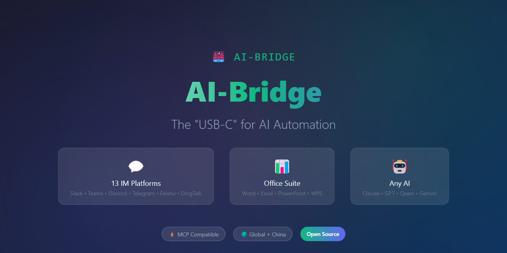
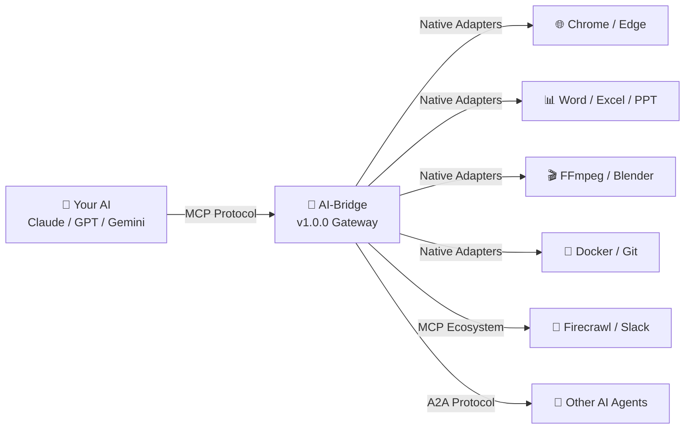
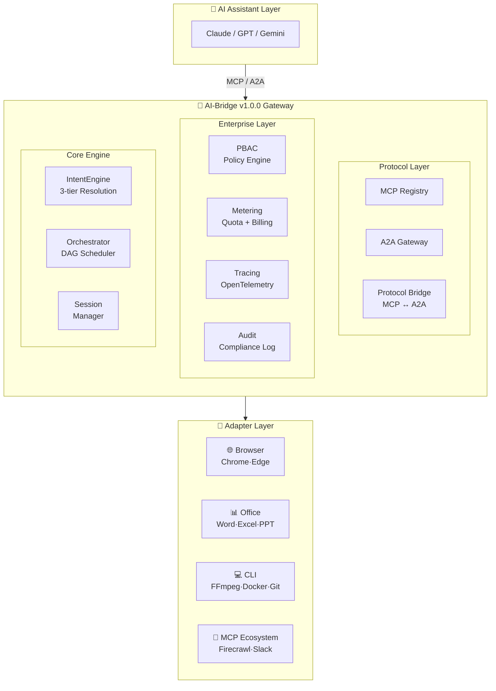

<div align="center">



<br/><br/>

# 🌉 AI-Bridge

### *From Chat to Action — Let AI Control Any Desktop App*

<br/>

<p>
  <a href="https://github.com/Louis830903/AI-Bridge/releases">
    
  </a>
  <a href="https://github.com/Louis830903/AI-Bridge/stargazers">
    
  </a>
  <a href="https://python.org">
    
  </a>
  <a href="https://modelcontextprotocol.io">
    
  </a>
</p>

<p>
  
  
  
  
  
</p>

<br/>

<p>
  <a href="README_CN.md">🇨🇳 中文</a> •
  <a href="#-why-ai-bridge">🔥 Why</a> •
  <a href="#-30-second-demo">⚡ Demo</a> •
  <a href="#-quick-start">🚀 Quick Start</a> •
  <a href="#-architecture">🏗️ Architecture</a> •
  <a href="#-enterprise">🔐 Enterprise</a>
</p>

</div>

---

## 🔥 Why AI-Bridge?

<table>
<tr>
<td width="50%">

### ❌ Without AI-Bridge
```
User: "Generate monthly sales PPT"
AI:   "I can't interact with Office.
       Here's some Python code you
       could try manually..."
```

**AI is a glorified search engine** 😞

</td>
<td width="50%">

### ✅ With AI-Bridge
```
User: "Generate monthly sales PPT"
AI:   *Opens Excel → reads data*
      *Creates charts in PowerPoint*
      *Formats slides professionally*
      "Done! PPT saved to monthly-report.pptx"
```

**AI becomes your digital workforce** 🚀

</td>
</tr>
</table>

<br/>

<div align="center">

### ⚡ The Bridge



</div>

---

## ⚡ 30-Second Demo

```python
import asyncio
from aibridge.adapters.browser.chrome import ChromeAdapter

async def main():
    adapter = ChromeAdapter({"headless": False})
    await adapter.connect()
    
    await adapter.execute("goto", value="https://github.com")
    await adapter.execute("screenshot", options={"path": "github.png"})
    
    await adapter.disconnect()

asyncio.run(main())
# ☝️ AI opens Chrome → navigates → takes screenshot — all in 3 lines!
```

---

## 🛠️ Supported Tools

| Category | Tools | Adapters |
|:---:|---|---|
| 🌐 **Browser** | Chrome, Edge | Playwright-powered, full automation |
| 📊 **Office** | Word, Excel, PowerPoint, WPS | OpenXML / Win32 / LibreOffice |
| 🎬 **Media** | FFmpeg, ImageMagick, Blender, Shotcut, SoX, GIMP | CLI-native, 40+ codecs |
| 📄 **Docs** | Pandoc | 40+ format conversions |
| 🎵 **Download** | yt-dlp | 1000+ sites supported |
| 🐳 **DevOps** | Docker, Git, Prettier | Infrastructure as code |
| 🔗 **MCP Ecosystem** | Browser Use, Firecrawl, Notion, Slack, GitHub | Seamless interop |
| 🧠 **AI** | Aider (code assistant) | AI-assisted development |

---

## 🚀 Quick Start

```bash
# 1. Install
pip install ai-bridge

# 2. Add to Claude Desktop (claude_desktop_config.json)
# {
#   "mcpServers": {
#     "ai-bridge": {
#       "command": "python",
#       "args": ["-m", "aibridge"]
#     }
#   }
# }

# 3. Ask Claude:
# "Open Chrome, search 'AI trends 2025', take screenshots"
# "Convert report.docx to PDF and send via email"
# "Pull latest data from DB, generate Excel charts"
```

---

## 🛡️ Iron Curtain Test Pyramid

<div align="center">

```
           ┌─── L3 E2E (8) ───┐      ← --e2e flag, nightly CI
         ┌── L2 Integration (7) ──┐    ← --integration, Docker-in-Docker
       ┌─── L1 Component (22) ───┐     ← default, key interfaces
     ┌────── L0 Unit (907) ──────┐    ← default, core logic
    └────────────────────────────┘
        929 tests | 42% coverage
```

| Layer | Count | Type | Trigger |
|:---:|:---:|---|---|
| L3 | 8 | End-to-End | `--e2e` / nightly cron |
| L2 | 7 | Git + Office Integration | `--integration` / Docker |
| L1 | 22 | Intent / DAG / Bridge / PBAC | Always |
| L0 | 907 | Unit + Core + Enterprise | Always |

</div>

---

## 🏗️ Architecture



---

## 🔐 Enterprise Features

<details open>
<summary><b>🛡️ PBAC — Policy-Based Access Control</b></summary>

```python
from aibridge.enterprise import PolicyEngine, ToolPolicy

engine = PolicyEngine()
engine.register_policy(ToolPolicy(
    policy_id="data-team",
    statements=[{
        "effect": "allow",
        "actions": ["tool:call"],
        "resources": ["browser/*", "office/excel:*"],
    }]
))
result = engine.evaluate("alice", "tool:call", "browser/navigate")
# ✅ ALLOW
```
</details>

<details>
<summary><b>📊 Metering — Usage Tracking & Quota</b></summary>

```python
from aibridge.enterprise import MeteringCollector, QuotaManager

metering = MeteringCollector()
await metering.record(user_id="user1", tool="browser/navigate")

quota = QuotaManager(metering)
quota.set_user_quota("user1", QuotaConfig(max_calls_per_day=1000))
```
</details>

<details>
<summary><b>🔍 OpenTelemetry — Distributed Tracing</b></summary>

```python
from aibridge.enterprise import Tracer, TracerConfig

tracer = Tracer(TracerConfig(service_name="gateway"))
with tracer.start_as_current_span("tool_call") as span:
    span.set_attribute("user.id", "user1")
```
</details>

<details>
<summary><b>🤖 Multi-Agent DAG Orchestration</b></summary>

```python
from aibridge.core import TaskGraph, Orchestrator

graph = TaskGraph(name="research")
t1 = graph.add_task("search", "web-agent", "search")
t2 = graph.add_task("analyze", "nlp-agent", "analyze", depends_on={t1})
t3 = graph.add_task("report", "write-agent", "report", depends_on={t2})

result = await orchestrator.execute(graph)
# ✅ 3 agents collaborate in DAG, results flow automatically
```
</details>

---

## 📊 Performance

| Benchmark | Target | Actual | Status |
|---|---|---|---|
| L1 Intent Match (60 patterns) | < 100ms | ~0.3ms | ✅ |
| L1 No-Match Traversal | < 200ms | ~0.4ms | ✅ |
| Adapter Cold Start | < 2000ms | ~1.0ms | ✅ |
| Batch Registration (60 patterns) | ≥ 50 | 60 | ✅ |

---

## 📖 Docs & Links

| Resource | Link |
|---|---|
| 📚 Quick Start | [examples/basic_usage.py](ai-bridge/examples/basic_usage.py) |
| 🏗️ Gateway Demo | [examples/gateway_demo.py](ai-bridge/examples/gateway_demo.py) |
| 📋 Changelog | [CHANGELOG.md](ai-bridge/CHANGELOG.md) |
| 🤝 Contributing | [CONTRIBUTING.md](ai-bridge/CONTRIBUTING.md) |
| 🛡️ Security | [SECURITY_TOOLS.md](ai-bridge/tools/SECURITY_TOOLS.md) |

---

## 🌟 Star History

<div align="center">

[](https://star-history.com/#Louis830903/AI-Bridge&Date)

</div>

---

<div align="center">

<br/>

### 🙏 Acknowledgements

[Playwright](https://playwright.dev/) • [MCP](https://modelcontextprotocol.io/) • [A2A](https://google.github.io/a2a-spec/) • [OpenTelemetry](https://opentelemetry.io/) • [All Contributors](https://github.com/Louis830903/AI-Bridge/graphs/contributors) ❤️

<br/>

---

<br/>

**If AI-Bridge empowers your workflow, give us a ⭐!**

<br/>

```
     _    ___      ____       _     _            
    / \  |_ _|    | __ ) _ __(_) __| | __ _  ___ 
   / _ \  | |_____|  _ \| '__| |/ _` |/ _` |/ _ \
  / ___ \ | |_____| |_) | |  | | (_| | (_| |  __/
 /_/   \_\___|    |____/|_|  |_|\__,_|\__, |\___|
                                      |___/      

         From Chat to Action 🚀
```

<br/>

**Made with ❤️ for the AI Automation Community**

</div>
