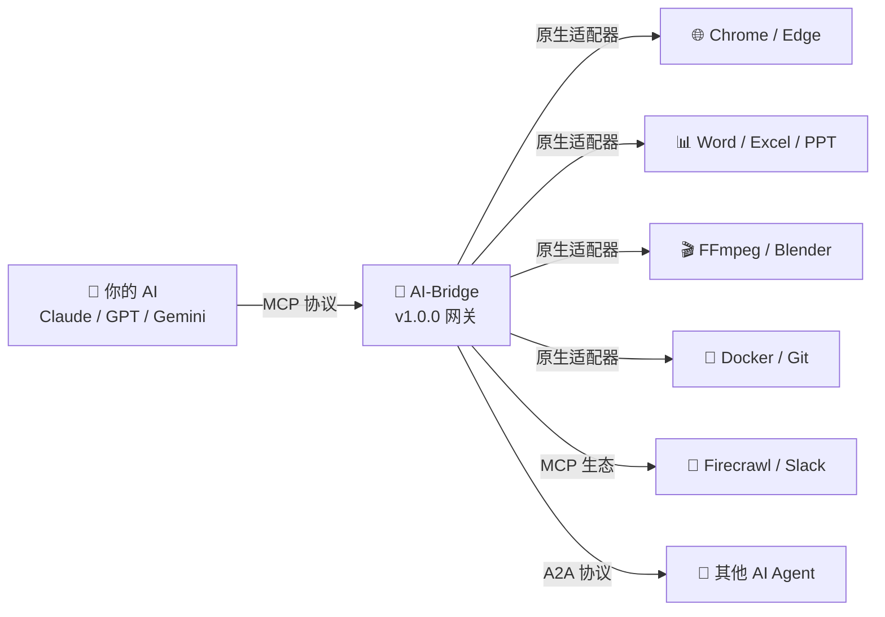
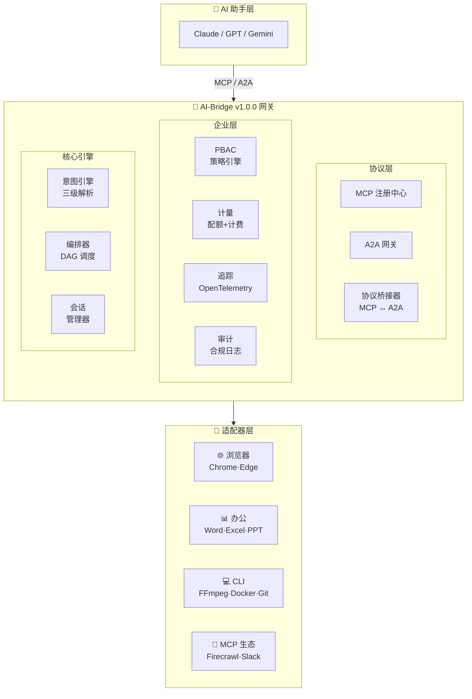

<div align="center">


<br/><br/>

# 🌉 AI-Bridge

### *让 AI 从聊天走向行动 — 一行代码，操控任意桌面软件*

<br/>

<p>
  <a href="https://github.com/Louis830903/AI-Bridge/releases">
    
  </a>
  <a href="https://github.com/Louis830903/AI-Bridge/stargazers">
    
  </a>
  <a href="https://python.org">
    
  </a>
  <a href="https://modelcontextprotocol.io">
    
  </a>
</p>

<p>
  
  
  
  
  
</p>

<br/>

<p>
  <a href="README.md">🇺🇸 English</a> •
  <a href="#-为什么选择-ai-bridge">🔥 为什么</a> •
  <a href="#-30-秒演示">⚡ 演示</a> •
  <a href="#-快速开始">🚀 快速开始</a> •
  <a href="#️-系统架构">🏗️ 架构</a> •
  <a href="#-企业级功能">🔐 企业级</a>
</p>

</div>

---

## 🔥 为什么选择 AI-Bridge？

<table>
<tr>
<td width="50%">

### ❌ 没有 AI-Bridge
```
用户："帮我生成月度销售 PPT"
AI：  "我无法操作 Office。
       这是你可以手动运行的
       Python 代码..."
```

**AI 只是一个高级搜索引擎** 😞

</td>
<td width="50%">

### ✅ 有了 AI-Bridge
```
用户："帮我生成月度销售 PPT"
AI：  *打开 Excel → 读取数据*
      *在 PPT 中生成图表*
      *自动排版美化*
      "搞定！已保存到 monthly-report.pptx"
```

**AI 成为你的数字员工** 🚀

</td>
</tr>
</table>

<br/>

<div align="center">

### ⚡ 核心桥梁



</div>

---

## ⚡ 30 秒演示

```python
import asyncio
from aibridge.adapters.browser.chrome import ChromeAdapter

async def main():
    adapter = ChromeAdapter({"headless": False})
    await adapter.connect()
    
    await adapter.execute("goto", value="https://github.com")
    await adapter.execute("screenshot", options={"path": "github.png"})
    
    await adapter.disconnect()

asyncio.run(main())
# ☝️ AI 自动打开浏览器 → 访问网站 → 截图 — 只需 3 行代码！
```

---

## 🛠️ 支持的工具

| 分类 | 工具 | 适配方式 |
|:---:|---|---|
| 🌐 **浏览器** | Chrome, Edge | Playwright 驱动，全自动化 |
| 📊 **办公** | Word, Excel, PowerPoint, WPS | OpenXML / Win32 / LibreOffice |
| 🎬 **媒体** | FFmpeg, ImageMagick, Blender, Shotcut, SoX, GIMP | CLI 原生，40+ 编码 |
| 📄 **文档** | Pandoc | 40+ 格式互转 |
| 🎵 **下载** | yt-dlp | 1000+ 网站支持 |
| 🐳 **开发** | Docker, Git, Prettier | 基础设施即代码 |
| 🔗 **MCP 生态** | Browser Use, Firecrawl, Notion, Slack, GitHub | 无缝互通 |
| 🧠 **AI** | Aider (代码助手) | AI 辅助开发 |

---

## 🚀 快速开始

```bash
# 1. 安装
pip install ai-bridge

# 2. 配置 Claude Desktop (claude_desktop_config.json)
# {
#   "mcpServers": {
#     "ai-bridge": {
#       "command": "python",
#       "args": ["-m", "aibridge"]
#     }
#   }
# }

# 3. 对 Claude 说：
# "打开 Chrome，搜索 AI 最新动态，截图保存"
# "把 report.docx 转成 PDF 并发送邮件"
# "从数据库拉最新数据，生成 Excel 图表"
```

---

## 🛡️ 铁幕测试金字塔

<div align="center">

```
           ┌─── L3 E2E (8) ───┐      ← --e2e 标志, 夜间 CI
         ┌── L2 集成 (7) ──┐        ← --integration, Docker-in-Docker
       ┌─── L1 组件 (22) ───┐       ← 默认运行, 关键接口
     ┌────── L0 单元 (907) ──────┐  ← 默认运行, 核心逻辑
    └────────────────────────────┘
        929 测试 | 42% 覆盖率
```

| 层级 | 数量 | 类型 | 触发条件 |
|:---:|:---:|---|---|
| L3 | 8 | 端到端 | `--e2e` / 夜间定时 |
| L2 | 7 | Git + Office 集成 | `--integration` / Docker |
| L1 | 22 | 意图/编排/桥接/PBAC | 始终运行 |
| L0 | 907 | 单元+核心+企业级 | 始终运行 |

</div>

---

## 🏗️ 系统架构



---

## 🔐 企业级功能

<details open>
<summary><b>🛡️ PBAC — 策略访问控制</b></summary>

```python
from aibridge.enterprise import PolicyEngine, ToolPolicy

engine = PolicyEngine()
engine.register_policy(ToolPolicy(
    policy_id="数据团队",
    statements=[{
        "effect": "allow",
        "actions": ["tool:call"],
        "resources": ["browser/*", "office/excel:*"],
    }]
))
result = engine.evaluate("小明", "tool:call", "browser/navigate")
# ✅ 允许
```
</details>

<details>
<summary><b>📊 计量 — 使用量追踪与配额</b></summary>

```python
from aibridge.enterprise import MeteringCollector, QuotaManager

metering = MeteringCollector()
await metering.record(user_id="user1", tool="browser/navigate")

quota = QuotaManager(metering)
quota.set_user_quota("user1", QuotaConfig(max_calls_per_day=1000))
```
</details>

<details>
<summary><b>🔍 OpenTelemetry — 分布式链路追踪</b></summary>

```python
from aibridge.enterprise import Tracer, TracerConfig

tracer = Tracer(TracerConfig(service_name="网关"))
with tracer.start_as_current_span("tool_call") as span:
    span.set_attribute("user.id", "user1")
```
</details>

<details>
<summary><b>🤖 多 Agent DAG 编排</b></summary>

```python
from aibridge.core import TaskGraph, Orchestrator

graph = TaskGraph(name="研究流程")
t1 = graph.add_task("搜索", "web-agent", "search")
t2 = graph.add_task("分析", "nlp-agent", "analyze", depends_on={t1})
t3 = graph.add_task("报告", "write-agent", "report", depends_on={t2})

result = await orchestrator.execute(graph)
# ✅ 3 个 Agent DAG 协作，结果自动流转
```
</details>

---

## 📊 性能基准

| 基准测试 | 目标 | 实际 | 状态 |
|---|---|---|---|
| L1 意图匹配 (60 模式) | < 100ms | ~0.3ms | ✅ |
| L1 无匹配遍历 | < 200ms | ~0.4ms | ✅ |
| 适配器冷启动 | < 2000ms | ~1.0ms | ✅ |
| 批量注册 (60 模式) | ≥ 50 | 60 | ✅ |

---

## 📖 文档与资源

| 资源 | 链接 |
|---|---|
| 📚 快速入门 | [examples/basic_usage.py](ai-bridge/examples/basic_usage.py) |
| 🏗️ 网关演示 | [examples/gateway_demo.py](ai-bridge/examples/gateway_demo.py) |
| 📋 更新日志 | [CHANGELOG.md](ai-bridge/CHANGELOG.md) |
| 🤝 参与贡献 | [CONTRIBUTING.md](ai-bridge/CONTRIBUTING.md) |
| 🛡️ 安全工具 | [SECURITY_TOOLS.md](ai-bridge/tools/SECURITY_TOOLS.md) |

---

## 🌟 Star 趋势

<div align="center">

[](https://star-history.com/#Louis830903/AI-Bridge&Date)

</div>

---

<div align="center">

<br/>

### 🙏 致谢

[Playwright](https://playwright.dev/) • [MCP](https://modelcontextprotocol.io/) • [A2A](https://google.github.io/a2a-spec/) • [OpenTelemetry](https://opentelemetry.io/) • [所有贡献者](https://github.com/Louis830903/AI-Bridge/graphs/contributors) ❤️

<br/>

---

<br/>

**如果 AI-Bridge 帮到了你，请给个 ⭐ 支持！**

<br/>

```
     _    ___      ____       _     _            
    / \  |_ _|    | __ ) _ __(_) __| | __ _  ___ 
   / _ \  | |_____|  _ \| '__| |/ _` |/ _` |/ _ \
  / ___ \ | |_____| |_) | |  | | (_| | (_| |  __/
 /_/   \_\___|    |____/|_|  |_|\__,_|\__, |\___|
                                      |___/      

        让 AI 从聊天走向行动 🚀
```

<br/>

**为 AI 自动化社区倾心打造 ❤️**

</div>
